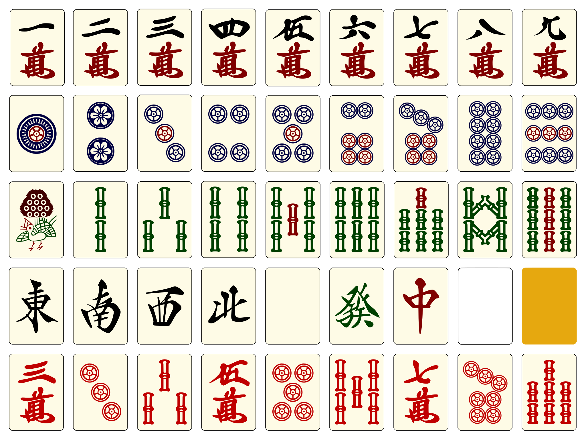

## High-quality vector SVG Japanese Riichi Mahjong tiles ##

Set 1:

Set 2:

These have been traced from high-res [raster templates](raster/) using Inkscape's
potrace function. The rasters were found online long time ago on some Chinese site
which I'm unable to properly credit unfortunately.

After tracing, curves had been hand-optimized for compactness, colored using symbolic
color `defs` (i.e. `fill:url(#tilegreen)`), grouped into individual tiles, and such.

TODO:
- [ ] automate extraction of individual tiles from panels
- [ ] hard-optimize "dist" outputs: drop `id`'s, flatten `<g>`'s, etc
- [ ] sprite font?
- [ ] Markdown extension for mahjong-related authoring?

### License ###

I don't own and don't claim any rights on the original source raster material.

The SVGs are derivative work of the rasters (and significant effort has been applied).

You may choose the MIT license or CC-PDDC (Public Domain) when using this repo.

    SPDX-License-Identifier: (MIT OR CC-PDDC)
